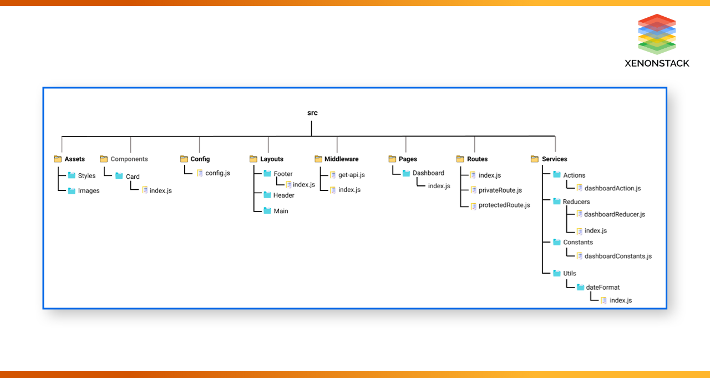

## TECH:
### Client:
 - ReactJS
 - Using:
	* react-router-dom (react router)
	* flowbite-react
	* react-icons
	* tailwindcss
 
### Server:
 - NodeJS 

##### ___________________________________________________________ #####

## INIT CLIENT REACTJS:
### 1. Create [pages] folder:
	src
		|_pages
			|_About.jsx
			|_Dashboard.jsx
			|_Home.jsx
			|_Projects.jsx
			|_SignIn.jsx
			|_SignUp.jsx

### 2. Install react-router-dom, tailwindcss

### 3. Create route for each page

### 4. Create Header Component
	- Create folder components
	- Create Header.jsx component then add into App.jsx
	
### 5. Install flowbite-react, react-icons to build Header
	- Using Link from 'react-router-dom' to handle link to homepage
	- Using TextInput component from 'Flowbite-react' and AiOutlineSearch from 'react-icons' to handle text input search 

### 6. Using Mongoose to connect to MongoDB
#### Install Mongoose, dotEnv (to get env variables)
	=> npm i mongoose
	=> npm i dotenv

### 7. Create User model by using mongoose.Schema
#### User model
			|_username:
								- type: String
								- required: true
								- unique: true
			|_email
								- type: String
								- required: true
								- unique: true
			|_password
								- type: String
								- required: true

### 8. Create User controller to handle logic + handle sign up requests - install bcryptjs
 Route: api/auth/signup
 Controller: 
  - Get request body { username, email, password: passwordHash }
	-> Create new User by using User model -> save new user to mongodb
	* Hash password before save to db by using bcryptjs

### 9. Add middleware and function to handle error
	src
		|_utils
			|_error.handler.js (return error with (statusCode, message))
		|_controllers
			|_error.controller.js (Handle handleError = (err, req, res, next) then return res with statusCode {success: false, statusCode, message})

### 10. Create sign-up page using tailwindcss 
	- Add form with:
		1. Username input:
			- Label: Your username
			- Type: TextInput
		2. Email input:
			- Label: Your Email
			- Type: TextInput <type='email'>
		3. Password input:
			- Label: Your Password
			- Type: TextInput <type='password'>

### 11. Install react-hook-form, yup to handle form
### Install axios to call api
[react-hook-form](https://react-hook-form.com/get-started#Quickstart)

	=> npm i react-hook-form yup axios
	***- Why react-hook-form?
	react-hook-form is a React library designed for managing forms with high performance and ease of use. Here's a summary of its key advantages:

	* High Performance: It optimizes performance by minimizing re-renders. This is achieved through the use of uncontrolled components with Refs, making it efficient for large and complex forms.

	* Ease of Use: The library is built to simplify form building and management. It offers a clear and understandable API, reducing the need for boilerplate code.

	* Easy Integration with UI Libraries: react-hook-form can be easily integrated with popular UI libraries, facilitating smooth and quick UI development.

	* Simple and Powerful Validation: It provides strong validation mechanisms with high customization. Validating data inputs with simple to complex rules is straightforward, including the ability to use external validation libraries like Yup.

	* Automatic Data Collection: The library automates data collection from form fields upon submission, saving time and effort.

	* Effortless Form State Management: Managing form states, including errors, input values, and submit states, is easy and intuitive.

### 12. Install vite-jsconfig-paths to config alias when import module

### 13. Install redux-persist to store redux state into local storage

### 14. Install firebase to handle signIn and signUp with google

### 15. Use firebase storage to store images and install react-circular-progressbar to handle progressbar while uploading
[react-circular-progressbar](https://www.npmjs.com/package/react-circular-progressbar)

### 16. Change from using reduxThunk, reduxToolkit to handle API state and UI state to using react-query and zustand
	* Why? - Transitioning from Redux Thunk and Redux Toolkit to React Query and Zustand has been a strategic move to streamline state management within our project. React Query is employed for handling server state, providing efficient fetching, caching, and updating of data with minimal boilerplate. Zustand offers a simpler and more concise approach to managing UI state, enhancing code readability and maintainability. This shift aligns with my goal of simplifying state management processes, reducing code complexity, and improving overall project scalability and developer experience.

### _______________________________________________________ ###	

### HEADER
 - Web Title to back Homepage
 - Text input to search
 - NavLink for each page
### _______________________________________________________ ###

## INIT SERVER NODEJS
### 1. Init package.json
	=> npm init -y

### 2. create folder [api] at the same root folder like [client]
	=> install express: [npm install express]

### Sample project structure
 
 